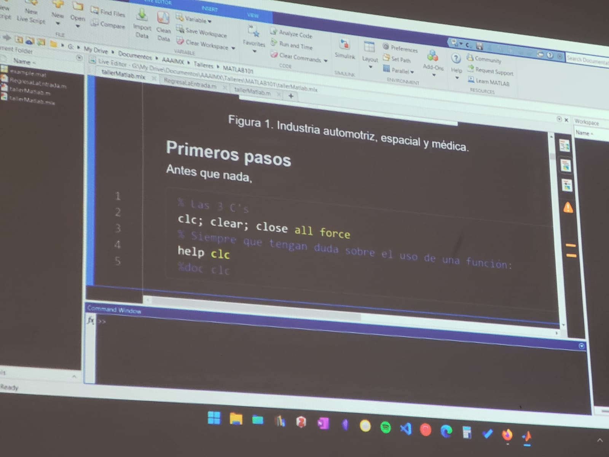

# MATLAB *Matriz Laboratory*

¿qué es? 
- Es un lenguaje de alto nivel 

## Aplicaciones 

Se utiliza en ingeneria de medio ambiente se utiliza principalmente para autos autonomos 

> Extención **.mlx**

Primeros pasos 

Antes que nada

